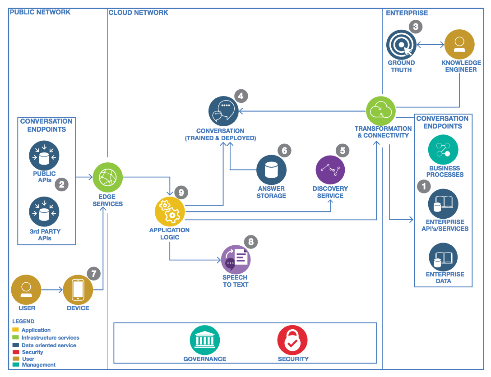
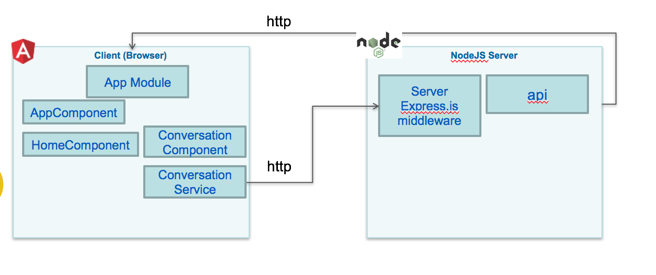
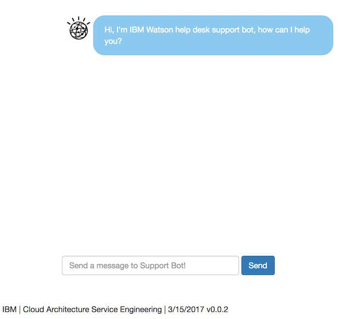

# Cognitive Architecture: Conversation Broker
This project offers a set of simple APIs in front of Watson Conversation to be consumed by your web interface, your mobile app  or even a business process defined in [IBM BPM on Cloud](http://www-03.ibm.com/software/products/en/business-process-manager-cloud).

This project is part of the 'IBM Cognitive Reference Architecture' suite, available at https://github.com/ibm-cloud-architecture/refarch-cognitive.

The project includes an [angular 2](http://angular.io) web application to illustrate a simple conversation front end which itself uses the APIs.
The project is designed as a micro service and deployable as a Cloud Foundry application on [IBM Bluemix](http://www.bluemix.net). The concept of broker is presented in the [IBM Cognitive Reference Architecture for Engagement](https://www.ibm.com/devops/method/content/architecture/cognitiveArchitecture#engagementDomain) as illustrated in the figure below:

 with the 'Conversation Application' icon.

## Current Version
This version is still under development, but is used for IBM internal [training](./doc/tutorial.md), so it is functional. It supports the current features:
* User interface is done with [Angular 2](angular.io) and support a simple  input field to enter a question to Watson and get a chat type of user experience.
* The supported questions depend on the Intents defined in Watson Conversation. A proposed Conversation workspace is available under the folder [wcs-workspace](./wcs-workspace) as a JSON file and represents a simple dialog for a IT support chat bot solution.
* Support the Backend for Front end pattern with a nodejs/ expressjs application which exposes a HTTP POST /api/conversation end point.
* Support the integration to BPM on cloud by triggering a business process via SOAP request by getting customer name and product name from the conversation.
* Support persisting the conversation inside a document oriented database like [Cloudand DB on bluemix](https://console.ng.bluemix.net/catalog/services/cloudant-nosql-db)

You may fork this project for your own purpose and develop on top of it. If you want to contribute please submit a pull request on this repository.

## Prerequisites

* You need your own github account
* You need to have a Bluemix account, and know how to use cloud foundry command line interface to push the application to Bluemix.
* You need to have [nodejs](https://nodejs.org/en/) installed on your computer with the [npm](https://www.npmjs.com/) installer tool.
* Clone current repository, or if you want to work on the code, fork it in your own github repository and then clone your forked repository on your local computer.

```
git clone https://github.com/ibm-cloud-architecture/refarch-cognitive-conversation-broker
cd refarch-cognitive-conversation-broker
npm install
```
* You need to install Angular 2 command line interface [cli.angular.io](http://cli.angular.io) tool ``` sudo  npm install -g @angular/cli``` on Mac for example.
* You need to install [nodemon](https://nodemon.io/) with ``` sudo npm install -g nodemo```

## Link to your Watson Conversation service
You need to create a Watson Conversation Service in IBM Bluemix, get the credential and update the file env-templ.json under server/routes folder with your own credential, then rename this file as env.json
```
{
    "conversation" :{
      "version":"2017-02-03",
      "username":"",
      "password":"",
      "workspaceId":"",
      "conversationId":""
    }
}
```
Rename the file as env.json

## Exposed REST APIs
The exposed aPI is:
 ```
title: conversation-broker
case:
  - operations:
      - verb: post
        path: /api/conversation
        data: {context:{}, text: "a question"}
 ```

The body should content at least the {text: message}. The context object is optional, it will be added with the Watson Conversation ID reference.

# Code explanation  
The project is split into two parts: the client side that is an Angular 2 single page application (code under client folder) and the server which is an expressjs app.


## Server side
The code is under the server folder. The server.js is the main javascript started when the *npm start* command is executed.
The server uses expressjs, serves a index.html page for the angular2 front end, and delegates to another javascript module any HTTP calls to url starting by **/api/***.  
Express is a routing and middleware web framework used to simplify web server implementation in nodejs. An app is a series of middleware function calls. [See expressjs.com](http://expressjs.com/en/guide/using-middleware.html) for more details.
The cfenv is used to deploy the application in Bluemix as a cloud foundry application.

```javascript
const express = require('express');
const app = express();

const api = require('./routes/api');
// Set our api routes
app.use('/api', api);

/ Catch all other routes and return the index file
app.get('*', (req, res) => {
  res.sendFile(path.join(__dirname, '../dist/index.html'));
});

// get the app environment from Cloud Foundry
var appEnv = cfenv.getAppEnv();
/**
 * Get port from environment and store in Express.
 */
const port =appEnv.port || '3000';

...
```
When a user enters the hostname url without any web context, the index.html page will be presented. Any URL with the pattern http://hostname/api will be supported by api.js script.

*dist* is a folder for scripts built with @angular/cli **ng build** command, so it contains the user interface javascripts generated code.

This code needs to be improved with authentication and authorization controls.

The package.json file specifies the minimum dependencies for the server and client codes.
```
"dependencies": {
  "@angular/common": "^2.4.0",
  "@angular/compiler": "^2.4.0",
  "@angular/core": "^2.4.0",
  "@angular/forms": "^2.4.0",
  "@angular/http": "^2.4.0",
  "@angular/platform-browser": "^2.4.0",
  "@angular/platform-browser-dynamic": "^2.4.0",
  "@angular/router": "^3.4.0",
  "core-js": "^2.4.1",
  "rxjs": "^5.1.0",
  "zone.js": "^0.7.6",
  "cfenv": "^1.0.x",
  "body-parser": "^1.15.0",
  "cookie-parser": "^1.4.1",
  "express": "^4.13.x",
  "express-session": "1.13.0",
  "extend": "^3.0.0",
  "request": "^2.72.0",
  "vcap_services": "^0.1.7",
  "watson-developer-cloud": "^2.x",
```

The [api.js](./server/routes/api.js) defines the URL to be used by angular 2 AJAX calls. Most of the user interactions on the Browser are supported by Angular 2, with its Router mechanism and the DOM rendering capabilities via directives and components. When there is a need to send data to the server for persistence or calling one of the Cognitive Service, an AJAX calls is done and the server will respond asynchronously later.

api.js uses the [express.js](http://https://expressjs.com) middleware router to handle URL mapping.

```javascript
const express = require('express');
const router = express.Router();
const router = express.Router();

router.post('/conversation',function(req,res){
  ...
```

On the HTTP POST to /api/conversation the text is in the request body, and can be sent to Watson conversation.

So the last piece is the Watson Conversation Broker under routes/features/conversation.js

This code is straight forward, it loads configuration from the env.json file or the VCAP service if the application is deployed to Bluemix, then it uses the Watson cloud developer javascript APIs to send the user message.

```javascript
exports.submit = function(message,next) {
      console.log(message);
      var wcconfig = extend(config.conversation, vcapServices.getCredentials('conversation'));
      var conversation = watson.conversation({
        username: wcconfig.username,
        password: wcconfig.password,
        version: 'v1',
        version_date: wcconfig.version
      });
      if (message.context === undefined) {
          message.context={"conversation_id":wcconfig.conversationId};
      }
      conversation.message({
          workspace_id: wcconfig.workspaceId,
          input: {'text': message.text},
          context: message.context
        },  function(err, response) {
            if (err)
              console.log('error:', err);
            else
              next(response);
        });
}
```
As the conversation holds a context object to keep information between different interactions, the code specifies a set of needed attributes: input, context and workspace ID which can be found in the Watson Conversation Service. If the context is empty from the first query, the conversationId is added. See Watson Conversation API for information about the context.

## Angular 2 client app
The code is under client folder. It was built using the Angular command line interface (ng new aname). The ng tool with the new command creates the foundation for a simple Angular 2 web app with the tooling to build and run a light server so the UI developer can work on the layout and screen flow without any backend.
It is possible to use the angular 2 server and be able to develop and test the user interface using
```
$ ng serve
or
$ ng build
```
And use the URL http://localhost:4200.
This type of testing is no more necessary as the server code exist and support the REST api needed by the user interface. So to run the server use the npm command:
```
$ npm run dev
```
And then use the URL with the port number reported by the trace:
```
[1] [nodemon] starting `node server/server server/server`
[1] info: ** No persistent storage method specified! Data may be lost when process shuts down.
[1] info: ** Setting up custom handlers for processing Slack messages
[1] info: ** API CALL: https://slack.com/api/rtm.start
[1] Server v0.0.1 starting on http://localhost:6012
```

## Client code organization
Under the client folder the first important file to consider is the index.html to load the angular 2 app.

 The following code illustrates the most important parts:
* including bootstrap css
* loading the angular *app-root* directive
* As we will use client side url routing the base href="/" is added to the header to give angular url base context.

```html
<head>
    <base href="/">
    <link href="https://maxcdn.bootstrapcdn.com/bootstrap/3.3.7/css/bootstrap.min.css" rel="stylesheet">
</head>
<body>
  <app-root>Welcome to IT Support App... Loading AppComponent content here ..</app-root>
</body>
```

The main.ts script is a standard angular 2 typescript file to load the main module.

The *app-root* tag is defined in the app/app.components.ts. This file uses a base html, used as template for header, body and footer parts. The body part will be injected using the Angular 2 routing mechanism.
```html
  <router-outlet></router-outlet>
```
Most of the user interactions on the Browser are supported by Angular 2, with its Router mechanism and the DOM rendering capabilities via directives and components. When there is a need to send data to the server for persistence or calling one of the Cognitive Service, an AJAX calls is done and the server will respond asynchronously later.

The application uses a unique route, as of now, but the approach should help you to add more elements as user interface components.

The application routing is defined in the app.module.ts as
```javascript
const routes: Routes = [
  { path: '', component: HomeComponent },
  { path: 'conversation', component: ConversationComponent },
  // otherwise redirect to home
  { path: '**', redirectTo: '' }
]
```
This module defines the different components of the application, the imports and routes. The routes json object declares the URLs internal to the angular app and which components is supporting it. So when /conversation will be reached the ConversationComponent will be loaded.

A home component will serve the body content of the main page. It, simply, displays a link to the conversation user interface. The conversation could have been integrated directly into the home page.

So the last important component is app/conv/conversation which defines a simple view with a scrolling area where the dialog will be displayed and an input field to let the user entering his request or answer.

The presented *div* part lists the text from an array of existing sentences, as we want to present the complete conversation. The syntax is using Angular 2 for loop to get each element of the array currentDialog and then add the text of this object in a div.

```html
<div *ngFor="let p of currentDialog">
   <div class="message-box">
     <div class="{{p.direction}}">
        <div class="{{p.direction+'-icon'}}" >
          <span *ngIf="p.direction === 'to-watson'" class="glyphicon glyphicon-user" aria-hidden="true"></span>
          <div *ngIf="p.direction === 'from-watson'" class="from-watson-icon">
            
          </div>
        </div>
        <div class="{{p.direction+'-text'}}" [innerHTML]="p.text">
        </div>
      </div>
  </div>
```

The conversation component uses the constructor to do a first call to Watson Conversation so the greetings intent is processed and Watson will start the dialog. If we do not use this technic, the user has to start the conversation, and most likely the greeting will not happen as a user will not start by a "hello" query.
```javascript
export class ConversationComponent {
  currentDialog : Sentence[]=[];
  context:any; // used to keep the Conversation context
  message:string;

  constructor(private convService : ConversationService){
  this.callConversationBFF("Hello");
}
```

The internal function below uses the conversation service to send the user input, and wait to get Watson response.
```javascript
callConversationBFF(msg:string) {
  this.convService.submitMessage(msg,this.context).subscribe(
    data => {console.log(data)
      this.context=data.context;
      let s:Sentence = new Sentence();
      s.direction="from-watson";
      s.text=data.text;
      this.currentDialog.push(s)
    },
    error => {
      return "Error occurs in conversation processing"
      }
  )
}
```
The component needs to have the currentDialog, and as it is a sentence we need to add a Sentence.ts under the conv folder. Sentence is a basic class with a text and a direction. The direction will be used to present who is speaking: to-watson when the user chat, from-watson when Watson answer.

The Context variable is used to keep conversation context between each interaction, this is an important mechanism in Watson conversation.   

The two other methods of this component are used to serve user interactions.

The conversation.service.ts defines the method to do the HTTP request to the backend for frontend server running in nodejs.

```javascript
submitMessage(msg:string,ctx:any): Observable<any>{
  let bodyString = JSON.stringify(  { text:msg,context:ctx });
  let headers = new Headers({ 'Content-Type': 'application/json' });
  let options = new RequestOptions({ headers: headers })
  return this.http.post(this.convUrl,bodyString,options)
       .map((res:Response) => res.json())
}
```
The HTTP module is injected via the constructor and the submitMessage use the http module with the post operation.
As the call is asynchronous, we want the function to return a promise. To do so we need to import rxjs module and sub modules, and use the map function.
The method declares the message and the context parameters. The context variable is here to keep the Watson conversation context so it can be sent back to the service so dialog context is kept. We need to propagate to the client as the conversation is with a unique client, where the server is serving multiple web browser.


# Work on the code
You can clone the repository, and uses the following commands:
```
$ npm install
```
Execute locally
```
$ npm run dev
```

# Tutorial
A detailed [tutorial](doc/tutorial.md) should help you build the Watson Conversation artifacts. The following [article](doc/persistence.md) addresses how to persist the conversation in Cloud based document database like Cloudant or on-premise database.

# Deploy to Bluemix
To be able to deploy to bluemix, you need a bluemix account and the command line interface.  

[](https://bluemix.net/deploy?repository=https://github.com/jbcodeforce/refarch-cognitive-conversation-broker)

You can use the ```cf push <bluemix-app-name>```

# Contribute
See the process in [main cognitive repository](https://github.com/ibm-cloud-architecture/refarch-cognitive).
