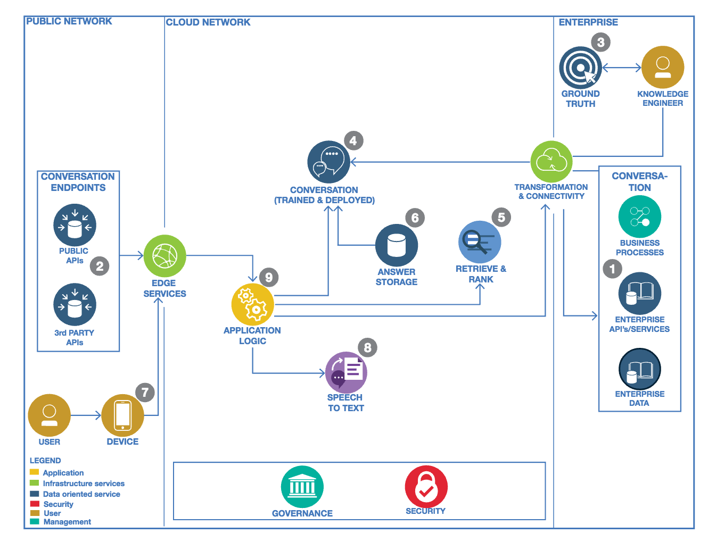

# refarch-cognitive-conversation-broker
This project offers a set of simple APIs in front of Watson Conversation to be consumed by your web interface, your mobile app  or even a business process defined in [IBM BPM on Cloud](http://www-03.ibm.com/software/products/en/business-process-manager-cloud). The project includes an [angular 2](http://angular.io) web application to illustrate a simple conversation front end.
The project is designed as a micro service and deployable as a Cloud Foundry application. The concept of broker is presented in the IBM Cognitive Reference Architecture for Engagement as illustrated in the figure below:

 with the 'Conversation Application' icon.

# Current Version
This version is still under development, it supports the current features:
* User interface done in Angular 2 to start the conversation with a hello message and support a simple input field to enter a question to Watson
* The supported questions depend on the Intents defined in Watson Conversation
* Support the Backend for Front end pattern with a nodejs/ expressjs application.
You may fork this project for your own purpose and develop by reusing the code. If you want to contribute please submit a pull request on this repository.

# Prerequisites

* You need to have a Bluemix account, and know how to use cloud foundry command line interface to push the application
* You need to have nodejs installed on your computer with the npm installer tool too.
* Clone current repository, or if you want to work on the code, fork it and clone your forked repository

```
git clone https://github.com/jbcodeforce/refarch-cognitive-conversation-broker
cd refarch-cognitive-conversation-broker
npm install
```

# Link to your Conversation service
You need to create a Watson Conversation Service in bluemix, get the credential and update the file env-templ.json under server/routes folder with your own credential
```
{
    "conversation" :{
      "version":"2017-02-03",
      "username":"",
      "password":"",
      "workspaceId":"",
      "conversationId":""
    }
}
```
Rename the file as env.json

# REST APIs exposed
The following api is exposed:
POST refarch-wcs-broker.mybluemix.net/api/conversation
The body should content a {text: message}

# Code explanation  
The project is split into two parts: the client side that is an Angular 2 single page application and the server which is an expressjs app.


## Server side
The code is under the server folder. The server.js is the main javascript started when the *npm start* command is executed.
The server uses expressjs, serves a index.html page for the angular2 front end, and delegates to another javascript the call to url /api/*

```
const express = require('express');
const app = express();

const api = require('./routes/api');
// Set our api routes
app.use('/api', api);

/ Catch all other routes and return the index file
app.get('*', (req, res) => {
  res.sendFile(path.join(__dirname, '../dist/index.html'));
});
...
```

This code needs to be improved with authentication and authorization controls.

The package.json file specifies the minimum dependencies for the server and client codes.

The api.js defines the URL to be used by angular 2 ajax calls. Most of the user interactions on the Browser are supported by Angular 2, with its Router mechanism and the DOM rendering capabilities via directives and components. When there is a need to send data to the server for persistence or calling one of the Cognitive Service, an AJAX calls is done and the server will respond asynchronously later.

api.js uses the express middleware router to handle URL mapping.

```
const express = require('express');
const router = express.Router();
const router = express.Router();

router.post('/conversation',function(req,res){
  ...
```
On the HTTP POST to /api/conversation the text is in the request body, and can be sent to Watson conversation.

So the last piece is the Watson Conversation Broker under routes/features/conversation.js

This code is straight forward, it loads configuration from the env.json file or the VCAP service if the application is deployed to Bluemix, then it uses the Watson cloud developer javacsript apis.

```
exports.submit = function(message,next) {
      console.log(message);
      var wcconfig = extend(config.conversation, vcapServices.getCredentials('conversation'));
      var conversation = watson.conversation({
        username: wcconfig.username,
        password: wcconfig.password,
        version: 'v1',
        version_date: wcconfig.version
      });
      if (message.context === undefined) {
          message.context={"conversation_id":wcconfig.conversationId};
      }
      conversation.message({
          workspace_id: wcconfig.workspaceId,
          input: {'text': message.text},
          context: message.context
        },  function(err, response) {
            if (err)
              console.log('error:', err);
            else
              next(response);
        });
}
```
As the conversation holds a context object to keep information between different interactions, the code specifies a set of needed attributes. See Watson Conversation API for information about the context.

## Angular 2 client app
The code is under client folder. It was built using the Angular command line interface (ng new aname). The ng tool with the new command creates the foundation for a simple Angular 2 web app with the tooling to build and run a light server so the UI developer can work on the layout and screen flow without any backend.
To compile the angular project on a development server, on the command prompt change to the new project directory and to start the server type:
```
ng serve
```
And use the URL http://localhost:4200 to test for the user interface.

## Client code organization
Under the client folder the first important file to consider is the index.html to load the angular 2 app. The following code illustrates the most important parts:
* including bootstrap css
* loading the angular *app-root* directive
* As we will use client side url routing the base href="/" is added to the header to give angular url base context.

```
<head>
    <base href="/">
    <link href="https://maxcdn.bootstrapcdn.com/bootstrap/3.3.7/css/bootstrap.min.css" rel="stylesheet">
</head>
<body>
  <app-root>Welcome to IT Support App... Loading AppComponent content here ..</app-root>
</body>
```

The main.ts script is a standard angular 2 typescript file to load the main module.

The *app-root* tag is defined in the app/app.components.ts. This file uses a base html, used as template for header, body and footer parts. The body part will be injected using the Angular 2 routing mechanism.
```
  <router-outlet></router-outlet>
```

The application uses a unique route, as of now, but the approach should help you to add more elements as user interface components.

The application routing is defined in the app.module.ts as
```
const routes: Routes = [
  { path: '', component: HomeComponent },
  { path: 'conversation', component: ConversationComponent },
  // otherwise redirect to home
  { path: '**', redirectTo: '' }
]
```
A home component will serve the body content of the main page. It, simply, displays a link to the conversation user interface. The conversation could have been integrated directly into the home page.

So the last important component is app/conv/conversation which defines a simple dialog interface and wraps the call to the server api into a service component.

The conversation component uses the contructor to do a first call to Watson Conversation so the greetings intent is processed and Watson will start the dialog. If we do not use this technic, the user has to start the conversation, and most likely the greeting will not happen as a user will not start by a "hello" query.
```
constructor(private convService : ConversationService){
  this.callConversationBFF("Hello");
}
```

The internal function below uses the conversation service to send the user input, and wait to get Watson response.
```
callConversationBFF(msg:string) {
  this.convService.submitMessage(msg,this.context).subscribe(
    data => {console.log(data)
      this.context=data.context;
      let s:Sentence = new Sentence();
      s.direction="from-watson";
      s.text=data.text;
      this.currentDialog.push(s)
    },
    error => {
      return "Error occurs in conversation processing"
      }
  )
}
```
The Context is used to keep conversation context between each interaction. The sentences are kept in an array to keep information for the user and user interface. The direction attribute of the sentence is used to keep who is talking. The strings from-watson or to-watson are also used as css classes to present a nicer interface.

The two other methods of this component are used to server user interaction.

The conversation.service.ts defines the method to do the HTTP request to the backend for frontend server running in nodejs.

```
submitMessage(msg:string,ctx:any): Observable<any>{
  let bodyString = JSON.stringify(  { text:msg,context:ctx });
  let headers = new Headers({ 'Content-Type': 'application/json' });
  let options = new RequestOptions({ headers: headers })
  return this.http.post(this.convUrl,bodyString,options)
       .map((res:Response) => res.json())
}
```

# Work on the code
You can clone the repository, and uses the following commands:
```
npm install
```
Execute locally
```
npm run dev
```


# Deploy to Bluemix
To be able to deploy to bluemix, you need an account.  

[](https://bluemix.net/deploy?repository=https://github.com/jbcodeforce/refarch-cognitive-conversation-broker)


# Contribute
We welcome your contribution. There are multiple ways to contribute: report bugs and improvement suggestion, improve documentation and contribute code.
We really value contributions and to maximize the impact of code contributions we request that any contributions follow these guidelines
* Please ensure you follow the coding standard and code formatting used throughout the existing code base
* All new features must be accompanied by associated tests
* Make sure all tests pass locally before submitting a pull request
* New pull requests should be created against the integration branch of the repository. This ensures new code is included in full stack integration tests before being merged into the master branch.
* One feature / bug fix / documentation update per pull request
* Include tests with every feature enhancement, improve tests with every bug fix
* One commit per pull request (squash your commits)
* Always pull the latest changes from upstream and rebase before creating pull request.

If you want to contribute, start by using git fork on this repository and then clone your own repository to your local workstation for development purpose. Add the up-stream repository to keep synchronized with the master.
