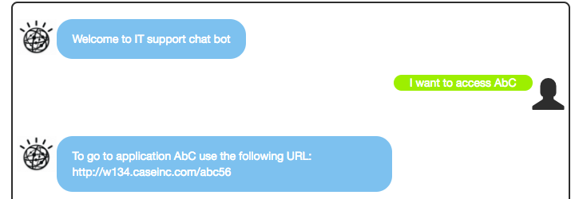

# Cognitive Architecture: Conversation Broker
This project offers a set of simple APIs in front of Watson Conversation to be consumed by your web interface, your mobile app, or micro service or even a business process running on [IBM BPM on Cloud](http://www-03.ibm.com/software/products/en/business-process-manager-cloud). It is implemented as a micro service, using resiliency and light weight implementation, packaging and deployment model.

This project is part of the **IBM Cognitive Reference Architecture** compute model available at https://github.com/ibm-cloud-architecture/refarch-cognitive.
# Table of Contents
* [Introduction](https://github.com/ibm-cloud-architecture/refarch-cognitive-conversation-broker#introduction)
* [Skill set](https://github.com/ibm-cloud-architecture/refarch-cognitive-conversation-broker#expected-knowledge)
* [Tutorial](doc/tutorial/README.md)
* [Pre-requisites](https://github.com/ibm-cloud-architecture/refarch-cognitive-conversation-broker#prerequisites)
* [Design considerations](./doc/design/README.md)
* [Code explanation](https://github.com/ibm-cloud-architecture/refarch-cognitive-conversation-broker#code-explanation)
* [Build and Deploy](https://github.com/ibm-cloud-architecture/refarch-cognitive-conversation-broker#build-and-deploy)
* [Compendium](https://github.com/ibm-cloud-architecture/refarch-cognitive-conversation-broker#compendium)

# Introduction
This implementation addresses multiple facets for developing a cloud native cognitive app:
* How to facade Watson Conversation to support service orchestration, persistence, conversations chaining... and any business logic needed to support an integrated hybrid chat bot.
* How to implement an 'IT Support' chat bot with Watson Conversation, with an exported [workspace](wcs-workspace/ITsupport-workspace.json). This is a common business requirement to use chat bot to address internal staff queries about IT applications or hardware. A second workspace is also delivered to support conversation inside a BPM coach to ask for help in the context of a process ([Supplier on boarding help](wcs-workspace/ITsupport-workspace.json)).
* A complete set of aspects to support production deployment like logging, monitoring, resiliency, security.

The project includes an [angular js](http://angular.io) web application to illustrate a simple conversation chat user interface which itself uses the broker APIs. The project is designed as a micro service, deployable as a containerized application on [IBM Bluemix](http://www.bluemix.net) [Kubernetes](https://www.ibm.com/blogs/bluemix/2017/03/kubernetes-now-available-ibm-bluemix-container-service/) Cluster. The concept of broker is presented in the [IBM Cognitive Reference Architecture for Conversation](https://www.ibm.com/devops/method/content/architecture/cognitiveArchitecture#engagementDomain), specially illustrated as 'Conversation Logic' in the figure below:


## Current Version
The current version is used for IBM internal [training](./doc/tutorial/README.md) and demonstration: it is functional and supports the following features:
* User interface is done with [Angular js](angular.io) and support a simple  input field to enter questions to Watson and get a chat type of user experience. There are two interface versions: one with tutorial and one without.
* The supported questions depend on the Intents defined in Watson Conversation. Two proposed Watson Conversation workspaces are available under the folder [wcs-workspace](./wcs-workspace) as JSON files:
  * one to support the CASE Inc IT support chat bot solution.
  * one to support the supplier on boarding business process contextual help.
* Support the Backend for Front end pattern with a nodejs/ expressjs application which exposes a HTTP POST /api/conversation end point.
* Support the integration to BPM on cloud by triggering a business process via SOAP request by getting customer name and product name from the conversation. See explanation [here](doc/integrate-bpm.md)
* Support persisting the conversation inside a document oriented database like [Cloudand DB on bluemix](https://console.ng.bluemix.net/catalog/services/cloudant-nosql-db). See detail [here](doc/persistence.md)

You may fork this project for your own purpose and develop on top of it. If you want to contribute please submit a pull request on this repository, see [rule of contribution](https://github.com/ibm-cloud-architecture/refarch-cognitive#contribute)


# Expected knowledge
On top of the [common](https://github.com/ibm-cloud-architecture/refarch-cognitive#Expected-skill-set) skill set defined for *cyan compute* the reader needs to get some good understanding of the following concepts:
* Know how to design a Watson Conversation, if not familiar doing the attached [step by step tutorial](./doc/tutorial/README.md) should help you  developing the Watson Conversation workspace with intent, entities definition and conversation flow needed for the IT support demonstration.
* The following [article](doc/persistence.md) addresses how to persist the conversation in Cloud based document database like Cloudant or an on-premise database.

# Prerequisites

* You need your own github.com account
* You need to have a Bluemix account, and know how to use cloud foundry command line interface to push the application to Bluemix.
* You need to have [nodejs](https://nodejs.org/en/) installed on your computer with the [npm](https://www.npmjs.com/) installer tool.
* Clone current repository, or if you want to work on the code, fork it in your own github repository and then clone your forked repository on your local computer.

```
git clone https://github.com/ibm-cloud-architecture/refarch-cognitive-conversation-broker
cd refarch-cognitive-conversation-broker
npm install
```
* You need to install Angular 2 command line interface [cli.angular.io](http://cli.angular.io) tool ``` sudo  npm install -g @angular/cli``` on Mac for example.
* You need to install [nodemon](https://nodemon.io/) with ``` sudo npm install -g nodemo```


# Code explanation  
The project is split into two parts: the client side that is an Angular 2 single page application (code under client folder) and the server which is an expressjs app with code under folder:


## Demonstration script
If you want to see the conversation working go to the [deployed app](http://refarch-wcs-broker.mybluemix.net/) and run the following [demonstration script](doc/demo/demoscript.md).

## Server side
The code is under the *server/* folder. The server.js is the main javascript entry point code, started when the *npm start* command is executed.
The server uses *expressjs*, serves a index.html page for the angular front end, and delegates to another javascript module (routes/api.js) any HTTP calls to url starting with **/api/***.  
Expressjs is a routing and middleware web framework used to simplify web server implementation in nodejs. An app is a series of middleware function calls. [See expressjs.com](http://expressjs.com/en/guide/using-middleware.html) for more details.
The cfenv is used to deploy the application in Bluemix as a cloud foundry application.

```javascript
const express = require('express');
const app = express();

var config = require('./config/config.json');
require('./routes/api')(app,config)

/ Catch all other routes and return the index file
app.get('*', (req, res) => {
  res.sendFile(path.join(__dirname, '../dist/index.html'));
});

// get the app environment from Cloud Foundry
var appEnv = cfenv.getAppEnv();
/**
 * Get port from environment or local config parameters.
 */
const port = process.env.PORT || config.port;
..

```
When a user enters the hostname url without any web context, the index.html page will be presented. Any URL with the pattern http://hostname/api will be supported by api.js script.

*dist* is a folder for scripts built with @angular/cli **ng build** command, so it contains the user interface generated code.

This code needs to be improved with authentication and authorization controls.

The package.json file specifies the minimum dependencies for the server and client codes. The interesting dependencies is the watson-developer-cloud module needed to interact with any on cloude Watson service.
```
"dependencies": {
  ...
  "body-parser": "^1.15.0",
  "cookie-parser": "^1.4.1",
  "express": "^4.13.x",
  "express-session": "1.13.0",
  "request": "^2.72.0",
  "watson-developer-cloud": "^2.x",
```

The [api.js](./server/routes/api.js) defines the URLs to be used by *angular 2* AJAX calls. The user interactions in the Browser are supported by Angular 2, with its own Router mechanism and with its DOM rendering capabilities via directives and components. When there is a need to send data to the server for calling one of the Cognitive Service, an AJAX calls is done and the server will respond asynchronously later.

*api.js* uses the [express.js](http://https://expressjs.com) middleware router to handle URL mapping.

```javascript
module.exports = function(app,config) {

// Support REST call
app.post('/api/conversation',function(req,res){
    if(!req.body){
      res.status(400).send({error:'no post body'});
    } else {
      if (req.body.context.type !== undefined && req.body.context.type == "sodb") {
        conversation.sobdConversation(config,req,res);
      } else {
        conversation.itSupportConversation(config,req,res);
      }
    }
});
}
```

On the HTTP POST to /api/conversation the text is in the request body, and can be sent to Watson conversation. The code here is illustrating how to support different conversations from the user interface: for demonstration purpose the base interface is using the IT support conversation, but there is a second conversation for the Supplier on boarding business process (sobd) to use, so a second interface is used, and the context.type variable will help to understand what conversation is called.

The second piece of interesting code is the Watson Conversation Broker under routes/features/conversation.js

This code is straight forward, it uses the configuration given as parameter then interacts with Watson cloud developer javascript APIs.

```javascript
module.exports = {
  /**
  Specific logic for the conversation related to IT support. From the response the
  code could dispatch to BPM.
  It persists the conversation to remote cloudant DB
  */
   itSupportConversation : function(config,req,res) {
        // this logic applies when the response is expected to be a value to be added to a context variable
        // the context variable name was set by the conversation dialog
        if (req.body.context.action === "getVar") {
            req.body.context[req.body.context.varname] = req.body.text;
        }
        sendMessage(config,req,config.conversation.workspace1,res,processITSupportResponse);
  }, // itSupportConversation
}
var sendMessage = function(config,req,wkid,res,next){
  conversation = watson.conversation({
          username: config.conversation.username,
          password: config.conversation.password,
          version: config.conversation.version,
          version_date: config.conversation.versionDate});

  conversation.message(...);
}
```

The two exposed functions are used to separate the call to the different Watson Conversation workspace. Remember a Watson Conversation service can have one to many workspaces. The settings are externalized in the config/config.json file.
```
"conversation" :{
  "version":"2017-02-03",
  "username":"291d93   ae533",
  "password":"aDF QlD",
  "workspace1":"1a3b0abfc1",
  "conversationId":"ITSupportConversation",
  "workspace2":"80b459cd2405",
  "usePersistence": true
},
```
Finally the last method is to send the text and conversation context to Watson Conversation.

As the conversation holds a context object to keep information between different interactions, the code specifies a set of needed attributes: input, context and workspace ID which can be found in the Watson Conversation Service. If the context is empty from the first query, the conversationId is added. See [Watson Conversation API](https://www.ibm.com/watson/developercloud/conversation/api/v1/) for information about the context.

### Service orchestration
A broker code is doing service orchestration. There are two examples illustrated in the `conversation.js` code via the **next** function given as parameter to sendMessage. For example if the dialog flow adds an **action** variable in the context then the code can test on it and call a remote service.

```javascript  
...
      if (rep.context.action === "trigger" && rep.context.actionName === "supplierOnBoardingProcess") {
            bpmoc.callBPMSupplierProcess(rep.context.customerName,rep.context.productName);
      }
   }

```  

See this [note](doc/integrate-bpm.md) for BPM integration detailed.
For detail on the persistence done in Bluemix Cloudant see: [Peristence](doc/persistence.md)  

## Angular 4 client app
The code is under *client* folder. It was built using the Angular command line interface (`ng new <aname>``). The `ng` tool with the `new` command creates the foundation for a simple Angular  web app with the tooling to build and run a light server so the UI developer can work on the layout and screen flow without any backend. It is possible to use the angular server and be able to develop and test the user interface using
```
$ ng serve
or
$ ng build
```
And use the URL http://localhost:4200.

In the current project this type of testing is no more necessary as the server code exists and supports the REST api needed by the user interface. So to run the server use the npm command:
```
$ npm run dev
```
And then use the URL with the port number reported by the trace:
```
[1] [nodemon] starting `node server/server server/server`
[1] info: ** No persistent storage method specified! Data may be lost when process shuts down.
[1] info: ** Setting up custom handlers for processing Slack messages
[1] info: ** API CALL: https://slack.com/api/rtm.start
[1] Server v0.0.1 starting on http://localhost:3001
```

## Client code organization
Under the client folder the first important file to consider is the `index.html` which loads the angular 2 app.

 The following code illustrates the most important parts:
* including bootstrap css
* loading the angular *app-root* directive
* and as we use client side url routing the base href="/" is added to the HTML header section to give *Angular* the url base context.

```html
<head>
    <base href="/">
    <link href="https://maxcdn.bootstrapcdn.com/bootstrap/3.3.7/css/bootstrap.min.css" rel="stylesheet">
</head>
<body>
  <app-root>Welcome to IT Support App... Loading AppComponent content here ..</app-root>
</body>
```

The main.ts script is a standard **Angular 2** typescript file to load the main module. Nothing to add.

The *app-root* tag is defined in the `app/app.components.ts`. This file uses a base html, used as template for header, body and footer parts. The body part will be injected using the Angular 2 routing mechanism.
```html
  <router-outlet></router-outlet>
```
Most of the user interactions on the Browser are supported by Angular 2, with its Router mechanism and its DOM rendering capabilities via directives and components. When there is a need to send data to the server for persistence or calling one of the Cognitive Service, an AJAX calls is done and the server will respond asynchronously later.

The application uses a unique route, as of now, but the approach should help you to add more elements as user interface components.

The application routing is defined in the app.module.ts as
```javascript
const routes: Routes = [
  { path: '', component: HomeComponent },
  { path: 'conversation/:type', component: ConversationComponent },
  // otherwise redirect to home
  { path: '**', redirectTo: '' }
]
```
This module defines the different components of the application, the imports and routes. The routes json object declares the URLs internal to the angular app and which components is supporting it. So when /conversation will be reached the ConversationComponent will be loaded. The `:type` is used to control the different user interface for the chatbot.

A home component serves the body content of the main page. It, simply, displays a link to the conversation user interface. The conversation could have been integrated directly into the home page.
```html
<div class="col-md-4 roundRect" style="box-shadow: 10px 10px 5px #10d1d1; border-color: #10d1d1;">
      <h2>Conversation</h2>
      <p>Start a simple IT support problem shooting conversation</p>
      <p><button (click)="conversation()" class="btn">Ask Support</button></p>
</div>
```

So the last important component is app/conv/conversation which defines a simple view which combines a scrolling area where the dialog will be displayed and an input field to let the user entering his request or answer.

The presented *div* part lists the text from an array of existing sentences, as we want to present the complete conversation history. The syntax is using Angular 2 `for loop` to get each element of the array `currentDialog` and then add the text of this object in a div.

```html
<div *ngFor="let p of currentDialog">
   <div class="message-box">
     <div class="{{p.direction}}">
        <div class="{{p.direction+'-icon'}}" >
          <span *ngIf="p.direction === 'to-watson'" class="glyphicon glyphicon-user" aria-hidden="true"></span>
          <div *ngIf="p.direction === 'from-watson'" class="from-watson-icon">
            
          </div>
        </div>
        <div class="{{p.direction+'-text'}}" [innerHTML]="p.text">
        </div>
      </div>
  </div>
```
Th `*ngIf` is an Angular 2 construct to apply condition on the html element it controls. Here the approach is to present different css class depending of the interaction direction:


The conversation component uses the constructor to do a first call to Watson Conversation so the greetings intent is processed and Watson starts the dialog. If we do not use this technic, the user has to start the conversation, and most likely the greeting will not happen as a user will not start by a "hello" query but directly by his/her request.
```javascript
export class ConversationComponent {


  constructor(private convService : ConversationService, private route: ActivatedRoute){
    // depending of the url parameters the layout can be simple or more demo oriented with instruction in html
    this.type=this.route.snapshot.params['type'];
    // Uncomment this line if you do not have a conversation_start trigger in a node of your dialog
    this.callConversationBFF("Hello");
  }
}
```

  

When the user click to the **Send** button the following code is executed to create a Sentence and then delegates to a second method
```
// method called from html button
submit(){
  let obj:Sentence = new Sentence();
  obj.direction="to-watson";
  obj.text=this.queryString;
  this.currentDialog.push(obj);
  this.callConversationBFF(this.queryString);
  this.queryString="";
}
```

The second function uses the conversation service to send the user input, and waits ( via subscribe to promise) to get Watson response as calls are asynchronous.
```javascript
callConversationBFF(msg:string) {
  this.convService.submitMessage(msg,this.context).subscribe(
    data => {console.log(data)
      this.context=data.context;
      let s:Sentence = new Sentence();
      s.direction="from-watson";
      s.text=data.text;
      this.currentDialog.push(s)
    },
    error => {
      return "Error occurs in conversation processing"
      }
  )
}
```

The conversation component needs to have the currentDialog, and as it is a sentence we need to add a Sentence.ts under the conv folder. Sentence is a basic class with a text and a direction. The direction will be used to present who is speaking: to-watson when the user chat, from-watson when Watson answer.

The Context variable is used to keep conversation context between each interaction, this is an important mechanism in Watson conversation to exchange data between application and dialog flow. It is detailed in *Using the context* section of the [tutorial](https://github.com/ibm-cloud-architecture/refarch-cognitive-conversation-broker/blob/master/doc/tutorial/README.md#using-context-object)   

The conversation.service.ts defines the method to do the HTTP request to the backend for frontend server running in nodejs as presented in previous section.

```javascript
submitMessage(msg:string,ctx:any): Observable<any>{
  let bodyString = JSON.stringify(  { text:msg,context:ctx });
  let headers = new Headers({ 'Content-Type': 'application/json' });
  let options = new RequestOptions({ headers: headers })
  return this.http.post(this.convUrl,bodyString,options)
       .map((res:Response) => res.json())
}
```
The HTTP module is injected via the constructor and the submitMessage use the HTTP module with the post operation.
As the call is asynchronous, we want the function to return a promise. To do so we need to import `rxjs` module and use its `map` function.
The method declares the message and the context parameters. The context variable is here to keep the Watson conversation context so it can be sent back to the service so dialog context is kept. We need to propagate to the client as the conversation is with a unique client, where the server is serving multiple web browser.


## Link to your Watson Conversation service
You need to create a Watson Conversation Service in IBM Bluemix, get the credential and update the file config/config.json with your own credential:
```
{
    "conversation" :{
      "version":"2017-02-03",
      "username":"",
      "password":"",
      "workspace1":"",
      "conversationId":"",
      "usePersistence": false
    }
}
```
If you want to use persistence, you need to create a Cloudant Service and define the credential in the same file.

## Exposed REST APIs
The exposed API is:
 ```
title: conversation-broker
case:
  - operations:
      - verb: post
        path: /api/conversation/base
        data: {context:{}, text: "a question"}
 ```

The body should content at least the {text: message} json object. The context object is optional, it will be added with the Watson Conversation ID reference in the code on the first call to the service.


# Build and Deploy

## Build
You can clone the repository, and uses the following commands:
```
# Install all the dependencies defined in the package.json
$ npm install
# Install angular Command Line Interface for compiling code
$ npm install -g @angular/cli
# the previous commands are to prepare the environment

# to compile the angular code
$ ng build
# to test the server with mocha
$ npm test
```

Execute locally
```
# execute with a build of angular code and start the server in monitoring mode,
# so change to server restarts the server.
$ npm run dev

# You can also execute the app without compilation and monitoring
$ npm start
```

## Deploy to Bluemix as Cloud Foundry
To be able to deploy to bluemix, you need a bluemix account and the command line interface.  
You can use the ```cf push <bluemix-app-name>```
You can use also this one click button.
[](https://bluemix.net/deploy?repository=https://github.com/ibm-cloud-architecture/refarch-cognitive-conversation-broker)


## Deploy to IBM Cloud Private
See the detailed [note here](doc/icp-deploy.md)

# Compendium

* [Cognitive conversation paper](https://www.ibm.com/devops/method/content/architecture/cognitiveConversationDomain)
* [Build dialog flow](https://console.bluemix.net/docs/services/conversation/dialog-build.html#dialog-build)


# Contribute
See the process in [main cognitive repository](https://github.com/ibm-cloud-architecture/refarch-cognitive).
