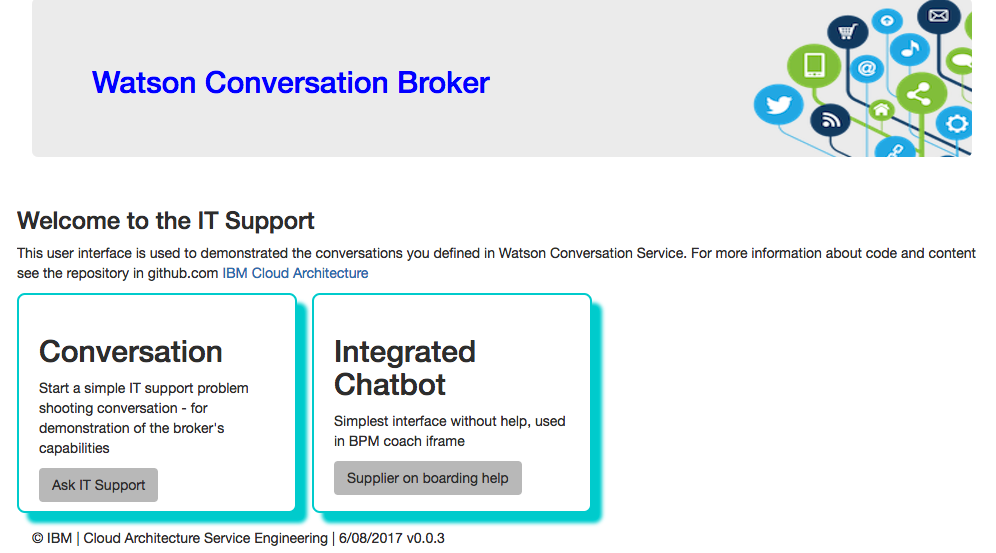
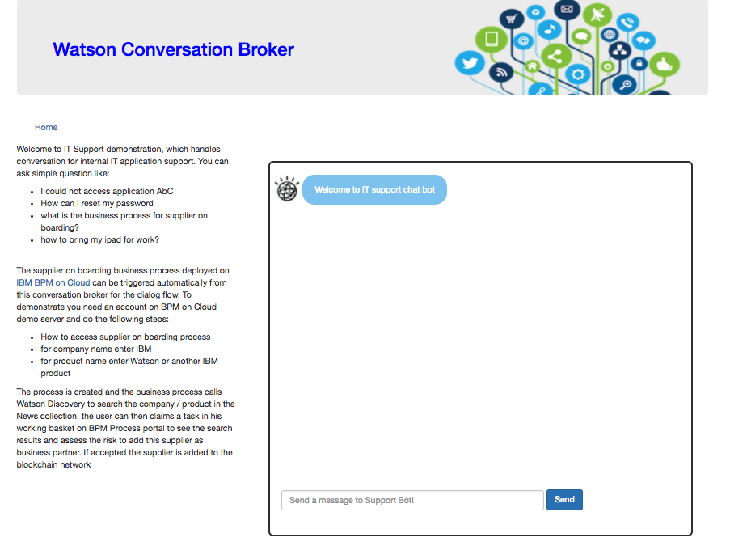
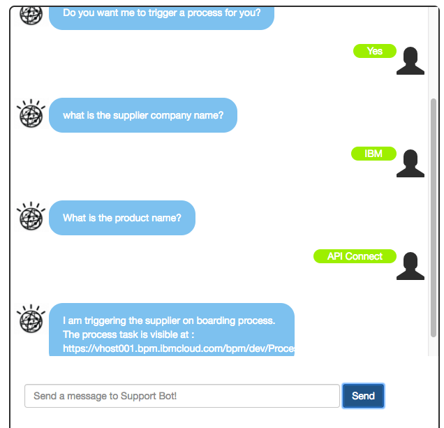

# Demonstration script
Welcome to IT Support demonstration, which handles conversation for internal IT application support.

The support director wants to modernize the way to support internal staff and offload his team from basic work. Currently 20000 tickets are issued in a year. 50% of the calls are answered in 7 minutes whereas there are many situations that reach up to 70 minutes for resolution. 92% of the calls are resolved by level 1 support. Employees of the Case Inc engage with customer support mostly through phones. Today, call center agents struggle to find some of the answers in a timely fashion as the systems are not integrated. This results in loss of productivity and frustration on the part of the bank employees. Level 1 support team get frustrated at times because of unavailability of the right information and proper guidance. The Level 1 support has to consult the Level 2 support team members to get some answers.   

The deployed application is visible here: [http://refarch-wcs-broker.mybluemix.net/](http://refarch-wcs-broker.mybluemix.net/)

The home page has two choices

## IT support Conversation
Click to *Ask IT Support* button to reach the IT Support chat bot:  

You can now ask simple questions like:
* I could not access application AbC
*  How can I reset my password
* what is the business process for supplier on boarding?
* how to bring my ipad for work?

### Triggering a business process from the conversation

The supplier on boarding business process deployed on [IBM BPM on Cloud](https://vhost001.bpm.ibmcloud.com/) can be triggered automatically by this conversation broker code as defined in the dialog flow.

The diagram above illustrates the dialog flow to support the **supplier on boarding** intent classification. The Watson response is **Do you want me to trigger the process for you?**. Then when the user answers *yes* the flow is asking for company name and then product name.

To demonstrate you need an account on BPM on Cloud demo server and do the following steps:

* How to access supplier on boarding process
* for company name enter IBM
* for product name enter Watson or another IBM product

  

The process is created and the business process calls Watson Discovery to search the company / product in the *News* collection, as illustrated by the process flow:

The user can then claim a task in his working basket on BPM Process portal
  
to see the search results and assess the risk to add this supplier as business partner.
  
If accepted the supplier is added to the blockchain network.

## Integrate Chatbot

The chat bot user interface can be embedded inside a BPM coach and called from a *Get help* button. The action triggers a popup window, which is an iframe, which call the conversation broker user interface to the url: [http://refarch-wcs-broker.mybluemix.net/conversation/sodb](http://refarch-wcs-broker.mybluemix.net/conversation/sodb).

