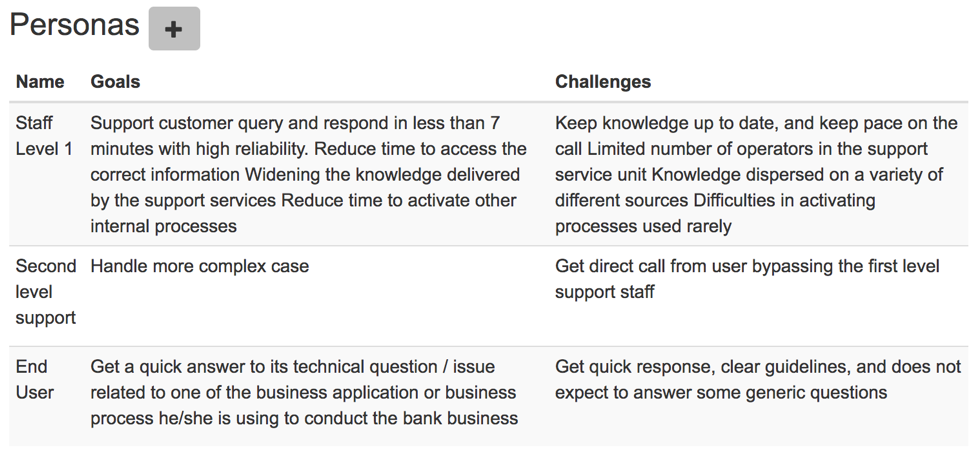
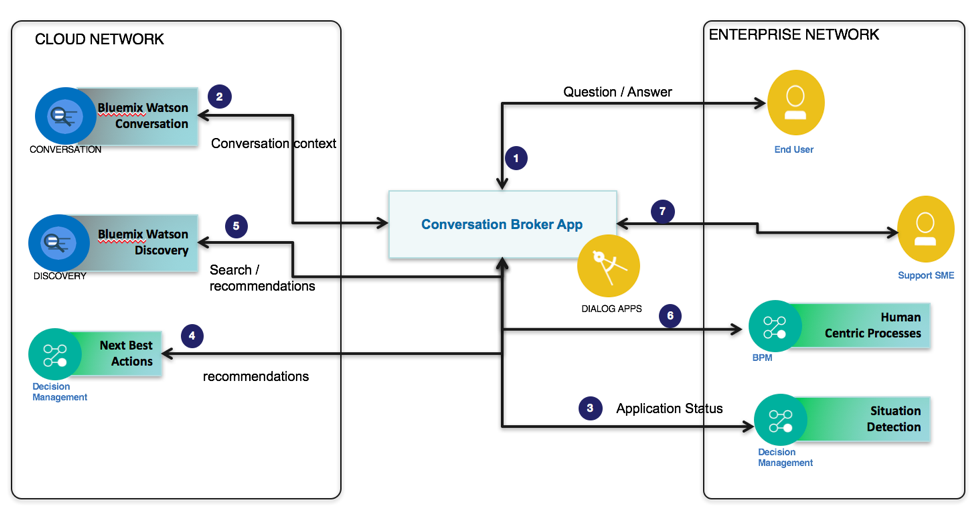

# Applying Design Thinking
When implementing a cognitive solution, we may want to apply the [Design Thinking](https://www.ibm.com/devops/method/content/think/practice_design_thinking/) methodology as it helps transforming a business improvement idea to concrete business application end users will use.  The principles of empathy with users, prototyping or Minimum Viable Product and tolerance for failure are applied as part of the method.
The storyboarding is one of such Design Thinking practice, where personas’ challenges and pains are addressed via stories. When engaging with a project team the first main exercise is to gather the requirements around Cognitive system and the use of the potential new application. The following application can help to formalize those requirements [Innovation Workshop](http://iwapp.mybluemix.net/).  
Empathy maps are developed.  First we need to gather is the list of Personas as presented in screen shot below:  

then we need to develop with the project team and end users the empathy map to address pains and challenge but more data points so we can be more in empathy with the user of the application. The following diagram is a map for the internal user persona developed using [Mural](https://app.mural.ly).  

Another artifact to build, as soon as possible, and then enhance over time, is a System Context Diagram which helps assessing what are the systems to interact with.

The system context serves also to organize the work into teams, micro services development and crowd sourcing work for the Natural Language training tasks.

The end user interacts with a WebApp developed with nodejs deployed as Cloud Foundry App on Bluemix. The main component is the Watson Conversation service, but the application could be connected to Watson Discovery to complement the dialog with searching into a knowledge corpus and to an event driven service which can aggregate the business application states: When an end user is complaining about not able to access a given business application, the Conversation could generate an action, which will lead to get real time state of the application. This state management is supported by Operational Decision Management Advanced which is a complex event processing platform. See proposed enhancement in

The dialog is stateless, meaning that it does not retain information from one interchange to the next. Your application is responsible for maintaining any continuing information. However, the application can pass information to the dialog, and the dialog can update the context information and pass it back to the application. So each conversation solution needs to include this service orchestration to control data gathering and dialog context.
