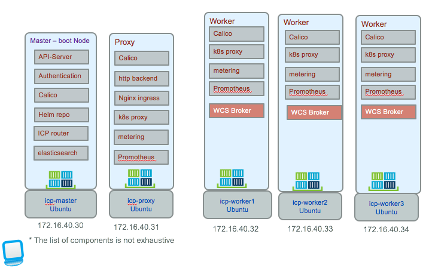

# Deploy Conversation Broker to IBM Cloud Private
We propose to package the code as a docker image, build a helm chart and then publish it to an ICP instance. To support higher availability we propose to have 3 replicas for the application, and expose it, via Ingress rule, so it can be visible outside of the ICP cluster. The target deployment may look like the following diagram where the webapp is running in pod as container and is deployed in 3 instances to support high availability:   


## Prerequisites
If you do not have an ICP installed you can use the following [note](https://github.com/ibm-cloud-architecture/refarch-cognitive/blob/master/doc/icp/README.md) to do a 'developer' installation of ICP Community Edition.

## Build
This project includes a docker file to build a docker image of the broker micro-service. You can build the image to your local repository using the command:
```
# first build the App
$ npm run build
$ docker build -t ibmcase/wcsbroker .
$ docker images
```
Then tag your local image with the name of the remote server where the docker registry resides, and the namespace to use. (`mycluster.icp:8500` is the ICP master server name)
```
$ docker tag ibmcase/wcsbroker mycluster.icp:8500/cyancompute/wcsbroker:v0.0.1
$ docker images
```
An image with the scope namespace is only accessible from within the namespace that it was pushed to.

## Push docker image to ICP private docker repository

If you have copied the ICP master host certificate / public key to the /etc/docker/certs.d/<hostname>:<portnumber> folder on you local computer, you should be able to login to remote docker engine. (If not see this section: [Access ICP docker](https://github.com/ibm-cloud-architecture/refarch-integration/blob/master/docs/icp/README.md#access-to-icp-private-repository)) Use a user known by ICP.
```
docker login mycluster.icp:8500
User: admin
```
Push the image
```
docker push mycluster.icp:8500/cyancompute/wcsbroker:v0.0.1
```
More informations could be found [here](https://www.ibm.com/developerworks/community/blogs/fe25b4ef-ea6a-4d86-a629-6f87ccf4649e/entry/Working_with_the_local_docker_registry_from_Spectrum_Conductor_for_Containers?lang=en)

## Build the helm package
Helm is a package manager to deploy application and service to Kubernetes cluster. Package definitions are charts which are yaml files to be shareable between teams.

The first time you need to build a chart for the web app.  Select a chart name (casewcsbroker) and then use the command:
```
cd chart
helm init casewcsbroker
```

This creates yaml files and simple set of folders. Those files play a role to define the configuration and package for kubernetes. Under the templates folder the yaml files use parameters coming from helm, the `values.yaml` and `chart.yaml`.

### Chart.yaml
This is a global parameter file. Set the version and name attributes, they will be used in `deployment.yaml`. Each time you deploy a new version of your app you can just change the version number. The values in the `Chart.yaml` are used in the templates.

### Add configMap templates
The broker micro service uses external configuration file, `config.json` to define parameters to access remote end points. When running on container within kubernetes it is good practice to externalize application configuration in `config map`. To do so we need to create a new template **templates/configmap.yaml**. This file uses the same structure as the config.json file but externalizes the parameter values from the values.yaml so that developer can changes only one file to control the configuration.

```yaml
apiVersion: v1
kind: ConfigMap
metadata:
  name: {{ template "fullname" . }}
  labels:
    chart: "{{ .Chart.Name }}-{{ .Chart.Version | replace "+" "_" }}"
data:
  config.json: |+
    {
        "conversation" :{
          "version" : "{{ .Values.config.conversation.version }}",
          "versionDate": "{{ .Values.config.conversation.versionDate }}",
          "username": "{{ .Values.config.conversation.username }}",
          "password": "{{ .Values.config.conversation.password }}",
          "workspace1":"{{ .Values.config.conversation.workspace1 }}",
          "workspace2":"{{ .Values.config.conversation.workspace2 }}",
          "workspace3":"{{ .Values.config.conversation.workspace3 }}",
          "conversationId": "{{ .Values.config.conversation.conversationId }}",
          "usePersistence": "{{ .Values.config.conversation.usePersistence }}"
        },

```
### Modify deployment.yaml
To 'ingect' the configuration from the configMap to the server nodejs app, the trick is to specify that the `config.json` file is coming from a logical volume.  To do so we need to define a Volume to mount to the config.json file in the deployment.yaml as the following:
In the deployment.yaml we add a volumeMount point to the container specification:

```yaml
spec:
  containers:
  - name: {{ .Chart.Name }}
    image: "{{ .Values.image.repository }}:{{ .Values.image.tag }}"
    imagePullPolicy: {{ .Values.image.pullPolicy }}
    ports:
    - containerPort: {{ .Values.service.internalPort }}
    volumeMounts:
    - name: config
      mountPath: /wcsbroker/server/config.json
      subPath: config.json
```
the path `/wcsbroker` comes from the dockerfile, working directory declaration.

```docker
COPY . /wcsbroker
WORKDIR /wcsbroker
```
so the mountPath will overwrite the `config.json` file.

The volume name (config) is arbitrary but needs to match a volume declared later in the deployment.yaml.

```yaml

   volumes:
      - name: config
        configMap:
          name:  {{ template "fullname" . }}
```
One volume, named `config` uses the configMap named using the template name of the helm package and match the configMap we defined above.

### Service and ingress
To expose the broker to other components deployed into the cluster we need to declare a service. `Services` group a set of pods and provide network connection to these pods for other services in the cluster without exposing the actual private IP address of each pod. As Pods are ephemeral in nature, resources like IP addresses allocated to it cannot be static. You can use Kubernetes services to make an app available to other pods inside the cluster or to expose an app to the internet or private network. This a decoupling capability.  

Each Service also gets an IP address (known as ClusterIP), which is routable only inside the cluster. A Service does the load balancing while selecting the Pods for forwarding the data/traffic. It uses the `labels` attribute to get the pods (see the declaration `spec.selector.app` below).

The templates/service.yaml was create by the command `helm create casewcsbroker`.
```yaml
spec:
  type: {{ .Values.service.type }}
  ports:
  - port: {{ .Values.service.externalPort }}
    targetPort: {{ .Values.service.internalPort }}
    protocol: TCP
    name: {{ .Values.service.name }}
  selector:
    app: {{ template "fullname" . }}
```
The `port` is the port number the service will be seen, while target port is the one of the webapp running in the pod. In `values.yaml` file the ports are set as
```yaml
service:
  name: wcsbrokersvc
  type: ClusterIP
  externalPort: 6100
  internalPort: 6100
```
The type `ClusterIP` for the service exposes it on a cluster internal IP network. It is reachable only from within the cluster. The routing is managed by the kube-proxy component in each worker nodes using Iptables. ClusterIP addresses are set by the master node when the services are created.

`Ingress` was introduce in k8s v1.1 and provide load balancing, SSL and name-based virtual hosting. It is a collection of rules that allow inbound connections to reach the cluster services using HTTP protocol. It is a OSI layer 7 service.
There is one important component to make implement the service contract of ingress: the ingress controller. In ICP it is a `nginx ingress` controller running in the proxy node that will implement the load balancing.

The templates/ingress.yaml file created defines a rule to route traffic
```
spec:
  rules:
    {{- range $host := .Values.ingress.hosts }}
    - host: {{ $host }}
      http:
        paths:
          - path: /
            backend:
              serviceName: {{ $serviceName }}
              servicePort: {{ $servicePort }}
    {{- end -}}
```
This ingress configuration will be POSTed to the API server running in k8s master node. Each rule matches against all incoming requests arriving to the master node. the `backend` is a service:port combination as described in the service.


### values.yaml
Specify in this file the docker image name and tag as you deployed into the docker private registry.
```yaml
iimage:
  repository: mycluster.icp:8500/cyancompute/wcsbroker
  tag: v0.0.1
  pullPolicy: Always
```

Try to align the number of helm package with docker image tag.

Finally declare the config values to point to the conversation parameters:
```yaml
config:
  conversation:
    version : v1
    versionDate: 2017-02-03
    username: 291d9e533...
    password: aDFBlD...
    workspace1: 1a3bfc1...
    conversationId: ITSupportConversation
    usePersistence: false
```


## Build and deploy the application package with helm
```
$ cd chart
$ helm lint casewcsbroker
# if you do not have issue ...
$ helm install --name wcsbroker --namespace cyancompute casewcsbroker

LAST DEPLOYED: Tue Nov 21 10:53:58 2017
NAMESPACE: cyancompute
STATUS: DEPLOYED

RESOURCES:
==> v1beta1/Ingress
NAME                     HOSTS                ADDRESS       PORTS  AGE
wcsbroker-casewcsbroker  wcsbroker.cyan.case  172.16.40.31  80     5m

==> v1/ConfigMap
NAME                     DATA  AGE
wcsbroker-casewcsbroker  1     7m

==> v1/Service
NAME                     CLUSTER-IP   EXTERNAL-IP  PORT(S)   AGE
wcsbroker-casewcsbroker  10.101.0.80  <none>       3001/TCP  7m

==> v1beta1/Deployment
NAME                     DESIRED  CURRENT  UP-TO-DATE  AVAILABLE  AGE
wcsbroker-casewcsbroker  3        3        3           0          7m


NOTES:
1. Get the application URL by running these commands:
  export POD_NAME=$(kubectl get pods --namespace cyancompute -l "app=wcsbroker-casewcsbroker" -o jsonpath="{.items[0].metadata.name}")
  echo "Visit http://127.0.0.1:8080 to use your application"
  kubectl port-forward $POD_NAME 8080:3001
```
From the above we can see that a deployment was created in kubernetes, the `casewcsbroker` container runs on three pods and a service got created to expose the deployment on the node at the cluster IP `10.101.0.80`. The NOTES section tells us how to access the pod from our local machine from port 8080. Connection made on the localhost port 8080 are forwarded to port 3001 of the pod. This is one way to test the application.


From the above we can see that a deployment was created in kubernetes, the casewcsbroker runs on one pod and a service got created to expose the deployment on the cluster IP on port 3001. And the NOTES section tells us how to access the pod.

You can login to ICP console and look at the Workload > Helm Release


### Use helm upgrade
When you want to change the version of the application:
```
$ helm list --namespace cyancompute
$ helm upgrade wcsbroker
```

### Verify the app is deployed
```
helm ls --all casewcsbroker
```
Point a web browser to http://wcsbroker.cyan.case to access the Application. Be sure to modify your local /etc/hosts file to map the name to the IP address of the cluster proxy server. Or use a new DNS entry with the same mapping.
