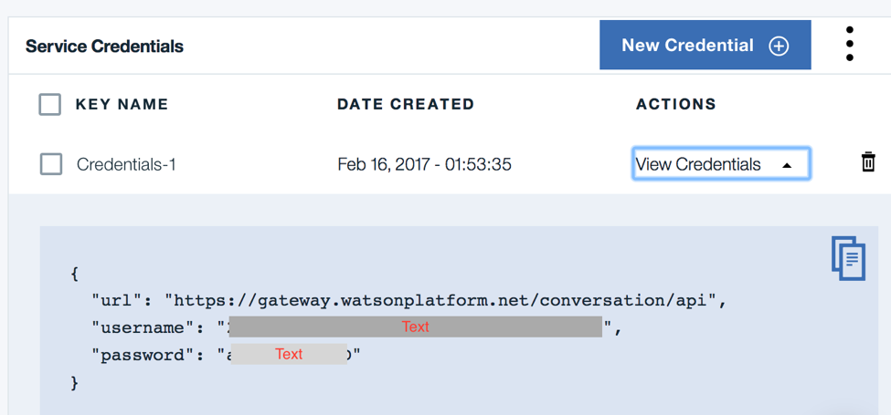

# Use Watson Conversation API
In this article we use curl to trigger the conversation dialog. The reference is at https://www.ibm.com/watson/developercloud/conversation/api/v1/. The API is protected by user authentication. To access to the user and password use Bluemix Conversation service and then the Credential:

